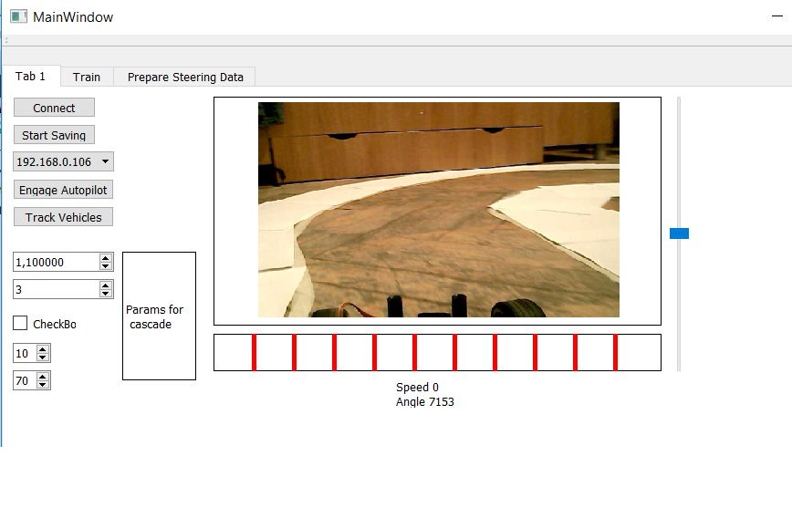
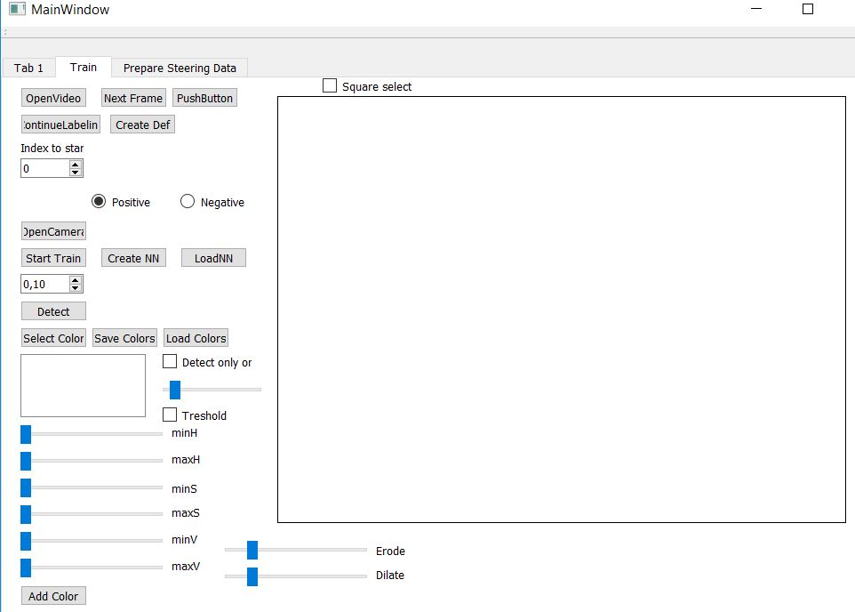
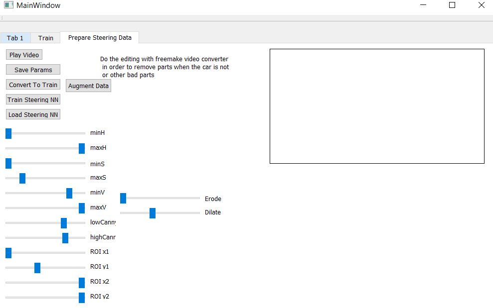

# Autonomous-RCVehicle

This Qt project was the first attempt to create the software for an autonomous vehicle.
It was supposed to be a client, that connected to the server found on Raspberry Pi.
The client was supposed to process the images received from the Raspberry Pi, and send back steering commands.
The images were processed by combinig the OpenCV library with my own implementation of a neural network.
I found that it was a waste of time and a headache to implement this in C++ thus I abandoned this project, but I still kept it for the collection of training images.
Here are some images of the GUI:

