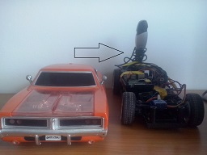
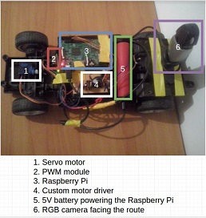

# Autonomous-Vehicle-Projects

For my batchelor thesis, my professor challenged me to prototype a self driving car as I told him that during the summer I learned some electronics and computer vision techniques.
For this I tried multiple things.
1. First I tested on Euro Truck Simulator. 
That meant to capture the video frames and the keyboards while I was playing. With these image->label dataset I tried to make the truck drive by itself, and I succeded in some degree. After training a neural network with 3 outputs( left right center) the truck was able to keep the lane but only at low speeds and easy low curved road.

2. Later I modified an RC vehicle

After modifying this vehicle I tried multiple types of neural networks and the best one was implemented in Tensorflow.
The result was that the car was able to keep the lane on a curved path.
Here you can see with the red dot the estimated steering angle by the neural network and the recorded angle on the training dataset.

And here some real tests.

I also added the feature to detect other vehicles using a Segmentation neural network, and a Kalman Filter to track them.
At the end of this demo you can see that the estimated trajectory of the vehicle (violet line) intersects the green rectangle (car chasis) and the car will stop.

This repository contains almost all of my work for this project and some of the papers.
